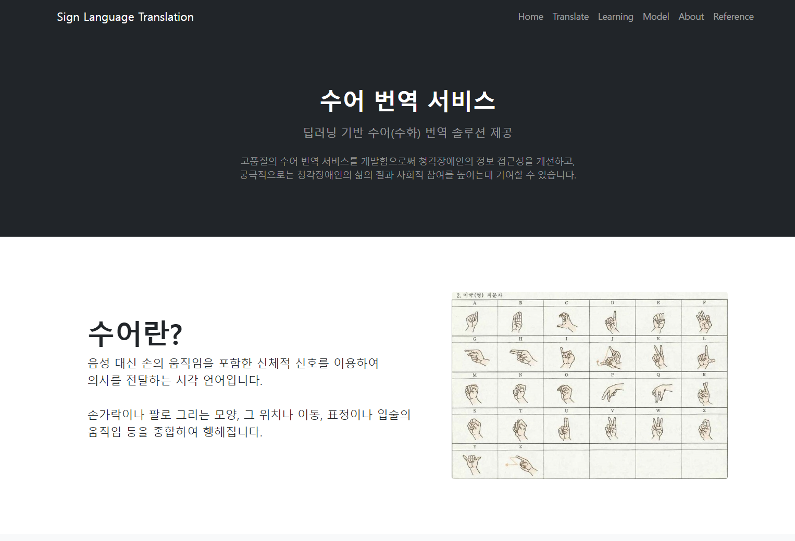
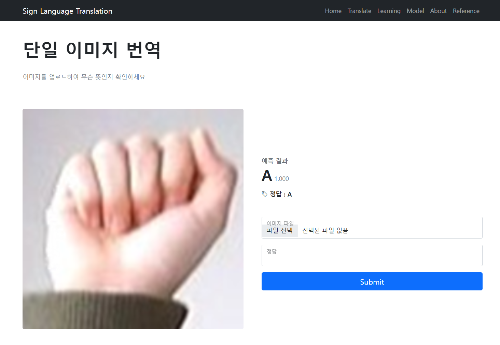
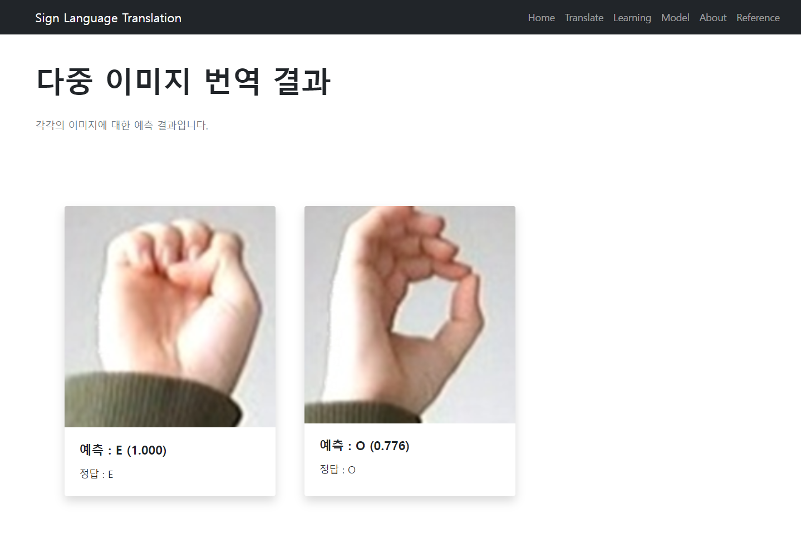
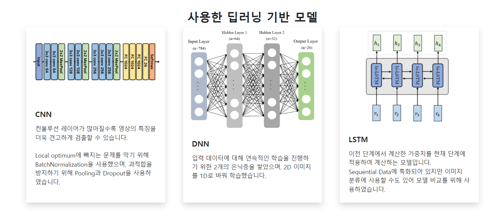
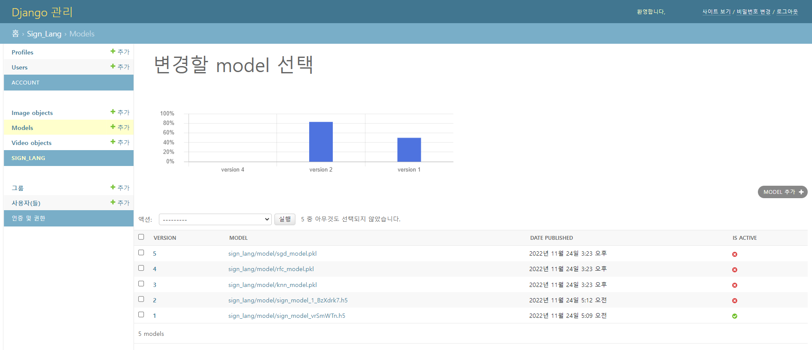

# **수어 번역 웹서비스 (Sign Language Translation)**

**22.11.22 ~ 22.11.24**  
KT AIVLE School 2기 미니프로젝트 7차 프로젝트

## **🔥 프로젝트 개요**

#### **WHY?**  
청각 장애는 전체 장애 인구 수 중 2위를 차지할 정도로 많습니다.  
장애인과 비장애인이 함께 사는 세상을 위해서 서로의 언어를 알아가는 과정이 필요합니다.  

#### **HOW?**
수어 이미지를 업로드하여 해당 글자를 배울 수 있습니다.  

 

    

 

## **주요 기능**

이미지를 업로드하여 번역 결과를 확인할 수 있습니다.
<table>
    <tr>
    <td></td>
    <td></td>
    </tr>
</table>

### **딥러닝 기반 수어 번역 모델**
3가지 유형의 딥러닝 모델을 이용해, 실험을 수행했으며,
실험 결과는 Model 페이지에서 확인할 수 있습니다.

    

### **딥러닝 모델 관리**
관리자 계정에서 모델 관리 및 성능을 모니터링을 할 수 있습니다.

    

 

## **🌱 역할 분담**

- **Frontend**  
    김수빈, 이지호, 조진호, 최재혁

- **Backend**  
    김수빈, 황재윤

- **AI Modeling**  
    이시영, 김유민

 

## **🌟 Contributor**

<table>
  <tr>
    <td align="center"><a href="https://github.com/aqaqsubin"> <b>Subin Kim</b></td>
    <td align="center"><a href="https://github.com/ym1522" width="125" height="170"> <b>Kim Yumin</b></td>
    <td align="center"><a href="https://github.com/Lee-Siyoung"> <b>Siyoung Lee</b></td>
    <td align="center"><a href="https://github.com/EZHO7518"> <b>Jiho Lee</b></td>
  </tr>
   <tr>
    <td align="center"><a href="https://github.com/JoJinho333"> <b>Jinho Cho</b></td>
    <td align="center"><a href="https://github.com/cjhh0797"> <b>Jaehyeok Choi</b></td>
    <td align="center"><a href="https://github.com/dearddyd"> <b>Jaeyoon Hwang</b></td>
    <td align="center"></td>
  </tr>
</table>
